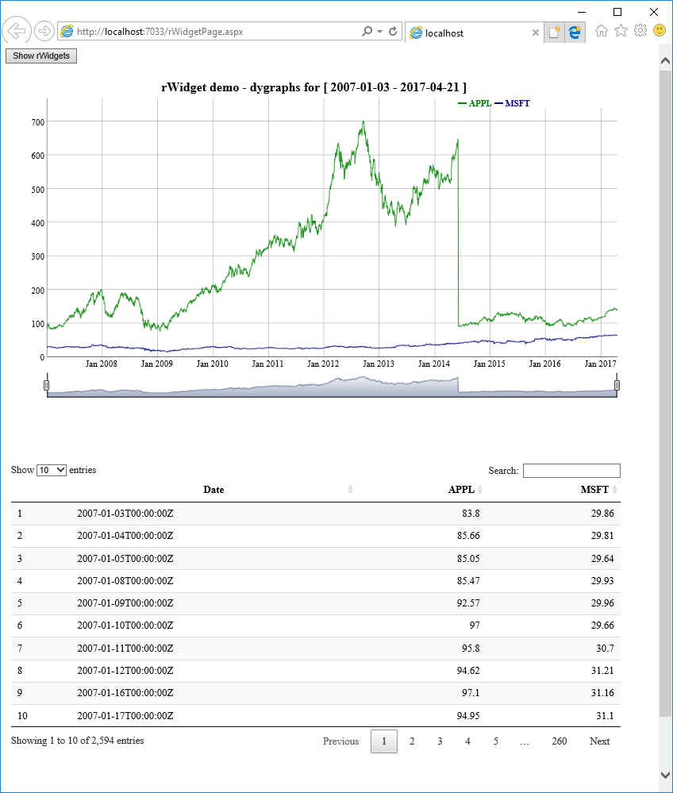

# rWidget
Create HTML widgets and embed them to web page on the fly.

The **rWidget** package provides a way to integrate [htmlwidgets](http://www.htmlwidgets.org/) to web page directly. [htmlwidgets](http://www.htmlwidgets.org/) is a great way to interface JavaScript libraries with R. However, you need to start with some "R" environment like R console, [R Markdown](http://rmarkdown.rstudio.com), etc. to use it. There are scenarios to use [htmlwidgets](http://www.htmlwidgets.org/) starting from non-R environment like your own web pages:
* Some JavaScript libraries are great, but they are too heavy for data guy, who happenly still needs web pages instead of just R console.
* Suppose a web page is doing some semantics analysis and you've got the keywords with scores. Is it possible to use [wordcloud2](https://github.com/lchiffon/wordcloud2) in web page to show the keywords without using JavaScript libraries directly? 
* [DT](http://rstudio.github.io/DT/), [dygraphs](http://rstudio.github.io/dygraphs/) and other [htmlwidgets](http://gallery.htmlwidgets.org/) are excellent. Can I use them in my *web page*, in R-way, not JS-way?

What if we can run R scripts on the fly? 

**rWidget** provides a solution to run R on the fly, generate HTML scripts from [htmlwidgets](http://www.htmlwidgets.org/) and embed html directly back to web pages. **rWidget** comes with an example to show how this happens end-to-end. 

# Installation

```S
devtools::install_github('processadd/rWidget')
```
# Getting Started
The primary flow is: web page -> Ajax call -> embed HTML output to web page. 



## Ajax call
Read data source. Pass results as JSON to SQL Server stored procedure. Call R scripts and rWidget to generate HTML scripts.

### Read data
Push logic to data. Get data ready to visualize. This solution assumes a web page rendering process, which expects short-time response, so generally the data read should be in an interactive way. You can use any way you like to read any data source. Just return results as JSON and the JSON will be passed to SQL Server store prodecure as input for R scripts.

### Call stored procedure to run R scripts
[SQL Server 2016 R service](https://docs.microsoft.com/en-us/sql/advanced-analytics/r/sql-server-r-services) provides a robust way to run R dynamically. It plays *R server* role here. T-SQL stored procedure runs R scripts. You can run R scripts by just calling the stored prodedure, say, with ADO.net.
The "inputs" for R scripts is passed through JSON. SQL Server 2016 can parse JSON and pass it to R scripts inside the stored procedure.
R scripts inside the stored procedure needs to call *rWidget* to generate the final HTML embedded back to web pages.

## Embed HTML output to web page
rWidget generates the HTML. You can figure out a way to embed to your web page. In examples provided by this package, iframe is used to render the HTML.
It is recommended to store htmlwidgets dependencies first in a virtual path where your web page can find. 

## Deploy web solution
* Register needed R packages to SQL Server.
* Generate dependencies for used htmlwidgets and put them under virtual path.

# You might be interested because
* Use htmlwidgets in your own normal web pages. You can go with any web page technologies and things like security management instead of using a cloud dashboard behind.
* You need SQL Server 2016. This SQL Server can be dedicated to "R server" usage and doesn't have to have any data or tables. You might prefer SQL Server controlled by yourself than a "R server" hosted in third-parties. 
* Stop re-inventing wheels. Take advantage of amazing [htmlwidgets](http://www.htmlwidgets.org/) "controls". 
* [SQL Server 2016 R service](https://docs.microsoft.com/en-us/sql/advanced-analytics/r/sql-server-r-services) provides not only a robust way to run R scripts on the fly, but also a way to process data with T-SQL and R hand-in-hand. After you get data from data source, before you send them to R to visulize , very likely you need to do some pre-process, say pivot data from row to col. You can do these pre-process with T-SQL and R together at the same place inside the stored procedure.
* [Crosstalk](https://rstudio.github.io/crosstalk/) is supported. Hopefully Crosstalk can be supported by more and more htmlwidgets.
